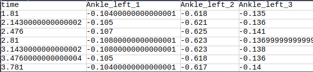
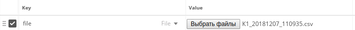

# Система анализа движения тела пациента - Томская область 

## Общее описание логики работы решения
1. При помощи VR технологий проводится двигательный тест

2. Приложение получает данные о координатах точек тела пациента, после прохождения теста

3. Приложение выделяет признаки из данных 

4. Приложение дает предсказание о болезни пациента

## Требования к окружению для запуска продукта
Платформа: кроссплатформенное решение

Используемый язык программирования: Python 3
скачать можно по ссылке: `https://www.python.org/downloads/`

    
## Сценарий сборки и запуска проекта

1. Скачайте репозиторий и распакуйте его в выбраной вами папке

2. Перейдите в папку `project` и откройте там консоль

3. Чтобы загрузить все библиотеки, для работы приложения, введите команду: `pip install -r requirements.txt`

4. Если у Вас не возникло никаких ошибок, то все получилось! Для того, чтобы запустить приложение, откройте консоль в папке `project`
и введите команду: `python app.py`

## Примеры использования

1. Подготовьте данные. Вы можете использовать такой же формы таблицы измерений, которые были предложены в датасете, но это не реконмендуется из-за
низкой производительности. Лучше всего использовать таблицы такой формы: 

То есть столбцы выглядят так: Первая колонка это время, остальные - точка тела и определенная координата.
Координаты идут в том порядке, в каком они шли в изначальном датасете. Строки в файле - это наблюдения координаты
каждой точки в текущий момент времени.
( В последней версии приложения появилась возможность использовать изначальный вид таблицы )
2.  Запустите приложение

3. Отправьте POST запрос на адрес `http://127.0.0.1:5000/api`, где в теле запроса  создайте объект,
имеющий ключ `file` и тело - сама таблица с наблюдениями. Выглядит это так:

4. После отправки запроса получайте ответ 
